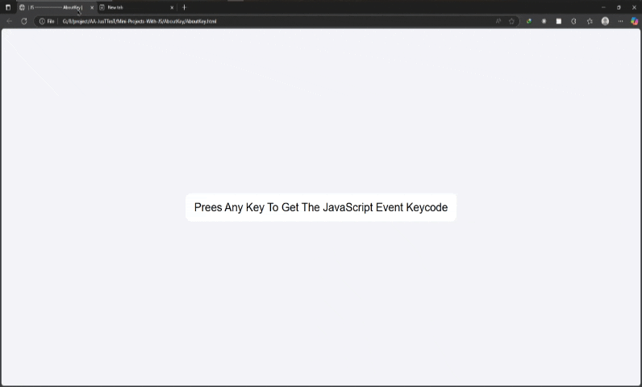

# پروژه AboutKey - نمایش اطلاعات کلیدهای کیبورد



## 📌 توضیحات

ابزاری برای نمایش اطلاعات فنی کلیدهای کیبورد با استفاده از جاوااسکریپت

## 💡 ویژگی‌ها

- نمایش کد کلید (KeyCode)
- شناسایی موقعیت کلید (چپ/راست/عددگیر)
- رابط کاربری ساده و واکنش‌گرا

## 🔧 تکنولوژی‌ها

<div align="center" style="
    display: flex;
    align-items: center;
    justify-content: center;
    gap: 1rem;
">
  
  
  
</div>

## 🚀 راه‌اندازی

```bash
git clone https://github.com/developer-iko-mike/JS_minis.git
cd JS_minis/AboutKey
open AboutKey.html
```

## 📜 مجوز

این پروژه تحت مجوز MIT منتشر شده است.
