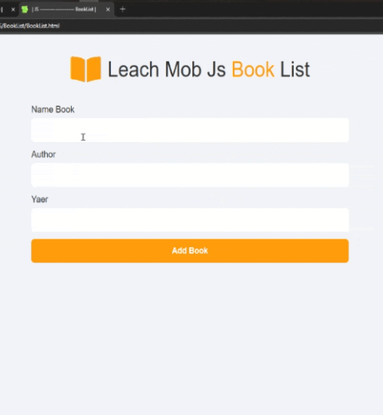

# پروژه BookList - مدیریت لیست کتاب‌ها



## 📚 توضیحات

یک اپلیکیشن مدیریت لیست کتاب‌ها با قابلیت ذخیره‌سازی اطلاعات در localStorage

## ✨ ویژگی‌های کلیدی

- افزودن کتاب با مشخصات کامل (نام کتاب، نویسنده، سال انتشار)
- اعتبارسنجی سال انتشار (تشخیص کتاب‌های تاریخی و آینده!)
- ذخیره‌سازی اطلاعات حتی پس از بستن مرورگر
- طراحی واکنش‌گرا و انیمیشن‌های زیبا
- امکان استفاده از کلیدهای میانبر (Enter, Esc, Delete)

## 🛠️ فناوری‌ها

<div align="center" style="display: flex; gap: 1rem; justify-content: center; margin: 1.5rem 0;">
  
  
  
</div>

## 🎮 راه‌اندازی و استفاده

1. کلون کردن ریپازیتوری:

```bash
git clone https://github.com/developer-iko-mike/JS_minis.git
```

2. رفتن به پوشه پروژه:

```bash
cd JS_minis/BookList
```

3. اجرای پروژه:

```bash
open BookList.html  # در مک‌اواس
start BookList.html # در ویندوز
```

## 📝 نحوه استفاده

- اطلاعات کتاب را وارد کنید
- با زدن دکمه Add Book یا کلید Enter کتاب اضافه می‌شود
- با کلیدهای Esc یا Delete فرم پاک می‌شود
- لیست کتاب‌ها حتی پس از بستن مرورگر حفظ می‌شود

## 📜 مجوز

این پروژه تحت [مجوز MIT](https://opensource.org/licenses/MIT) منتشر شده است.

<div style="margin-top: 2rem; text-align: center; font-size: 0.9rem; color: #666;">
  توسعه داده شده با ❤️ توسط developer-iko-mike
</div>
