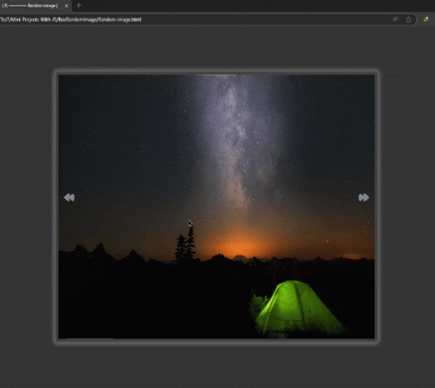

# پروژه Random Image - نمایش تصادفی تصاویر  

  

## 🖼️ توضیحات  
یک اسلایدر تصاویر ساده و زیبا با قابلیت نمایش خودکار و تغییر دستی تصاویر  

## ✨ ویژگی‌های کلیدی  
- نمایش اسلایدشو با 11 تصویر مختلف  
- تغییر خودکار هر 10 ثانیه  
- امکان حرکت بین تصاویر با دکمه‌های قبلی/بعدی  
- طراحی ریسپانسیو برای تمام دستگاه‌ها  
- افکت‌های hover زیبا روی دکمه‌های ناوبری  

## 🛠️ فناوری‌ها  
<div align="center" style="display: flex; gap: 1rem; justify-content: center; margin: 1.5rem 0;">
  
  
  
</div>

## 🚀 راه‌اندازی  
1. کلون کردن ریپازیتوری:  
```bash
git clone https://github.com/developer-iko-mike/JS_minis.git
```
2. رفتن به پوشه پروژه:  
```bash
cd JS_minis/BoxRandomImage
```
3. اجرای پروژه:  
```bash
open Random-image.html  # در مک‌اواس
start Random-image.html # در ویندوز
```

## 🎮 نحوه استفاده  
- تصاویر به صورت خودکار هر 10 ثانیه تغییر می‌کنند  
- برای مشاهده تصویر بعدی روی دکمه ▶ کلیک کنید  
- برای بازگشت به تصویر قبلی روی دکمه ◀ کلیک کنید  

## 📜 مجوز  
این پروژه تحت [مجوز MIT](https://opensource.org/licenses/MIT) منتشر شده است.  

<div style="margin-top: 2rem; text-align: center; font-size: 0.9rem; color: #666;">
  توسعه داده شده با ❤️ توسط developer-iko-mike
</div>