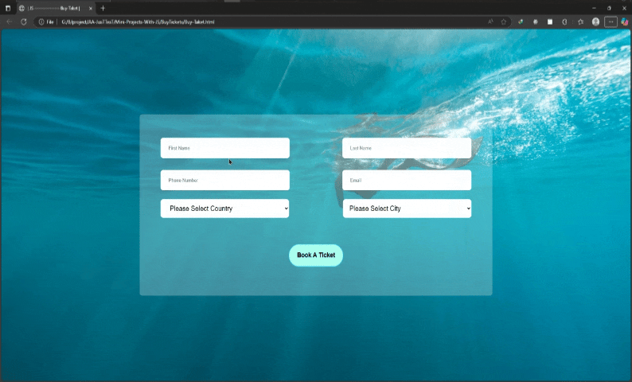

# پروژه Buy Ticket - فرم رزرو بلیط



## 🎫 توضیحات
یک فرم رزرو بلیط با قابلیت انتخاب کشور و شهرهای مربوطه به صورت پویا

## ✨ ویژگی‌های کلیدی
- رابط کاربری ساده و زیبا با پس‌زمینه گرادیان
- سیستم انتخاب شهرهای مربوط به هر کشور
- اعتبارسنجی اولیه فیلدها
- طراحی ریسپانسیو برای دستگاه‌های مختلف
- افکت‌های hover تعاملی روی دکمه‌ها

## 🛠️ فناوری‌ها
<div align="center" style="display: flex; gap: 1rem; justify-content: center; margin: 1.5rem 0;">
  
  
  
</div>

## 🚀 راه‌اندازی
1. کلون کردن ریپازیتوری:
```bash
git clone https://github.com/developer-iko-mike/JS_minis.git
```
2. رفتن به پوشه پروژه:
```bash
cd JS_minis/BuyTickets
```
3. اجرای پروژه:
```bash
open Buy-Taket.html  # در مک‌اواس
start Buy-Taket.html # در ویندوز
```

## 🎮 نحوه استفاده
- اطلاعات شخصی را وارد کنید
- کشور مورد نظر را انتخاب نمایید
- شهرهای مربوط به کشور انتخابی نمایش داده می‌شوند
- شهر مورد نظر را انتخاب کنید
- روی دکمه "Book a Ticket" کلیک کنید

## 📜 مجوز
این پروژه تحت [مجوز MIT](https://opensource.org/licenses/MIT) منتشر شده است.

<div style="margin-top: 2rem; text-align: center; font-size: 0.9rem; color: #666;">
  توسعه داده شده با ❤️ توسط developer-iko-mike
</div>