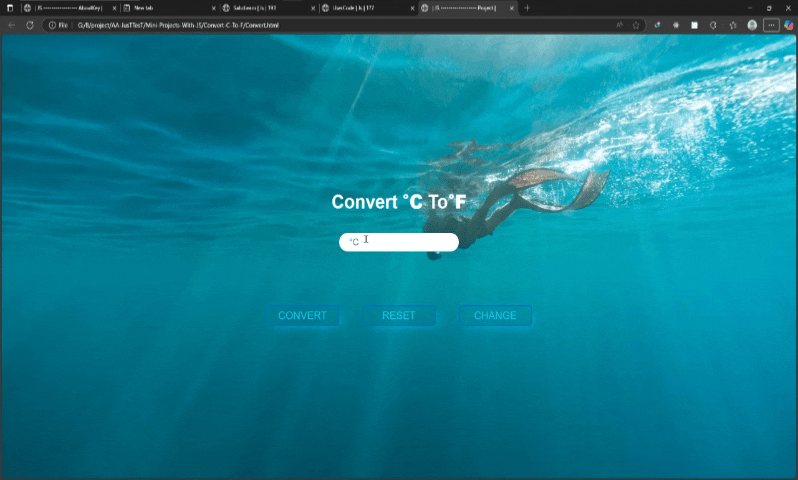

# پروژه Temperature Converter - مبدل دما  



## 🌡️ توضیحات  
یک مبدل دمای ساده و کاربردی برای تبدیل بین واحدهای سانتیگراد و فارنهایت  

## ✨ ویژگی‌های کلیدی  
- تبدیل دوطرفه بین سانتیگراد و فارنهایت  
- قابلیت تغییر جهت تبدیل با یک کلیک  
- اعتبارسنجی ورودی‌ها (فقط اعداد)  
- رابط کاربری مدرن با افکت‌های تعاملی  
- طراحی کاملاً ریسپانسیو  

## 🛠️ فناوری‌ها  
<div align="center" style="display: flex; gap: 1rem; justify-content: center; margin: 1.5rem 0;">
  
  
  
</div>

## 🚀 راه‌اندازی  
1. کلون کردن ریپازیتوری:  
```bash
git clone https://github.com/developer-iko-mike/JS_minis.git
```
2. رفتن به پوشه پروژه:  
```bash
cd JS_minis/Convert-C-To-F
```
3. اجرای پروژه:  
```bash
open Convert.html  # در مک‌اواس
start Convert.html # در ویندوز
```

## 🎮 نحوه استفاده  
- عدد مورد نظر را وارد کنید  
- برای تبدیل روی دکمه CONVERT کلیک کنید  
- برای تغییر جهت تبدیل از °C به °F و بالعکس از دکمه CHANGE استفاده کنید  
- برای پاک کردن ورودی‌ها از دکمه RESET استفاده نمایید  

## 📜 مجوز  
این پروژه تحت [مجوز MIT](https://opensource.org/licenses/MIT) منتشر شده است.  

<div style="margin-top: 2rem; text-align: center; font-size: 0.9rem; color: #666;">
  توسعه داده شده با ❤️ توسط developer-iko-mike
</div>