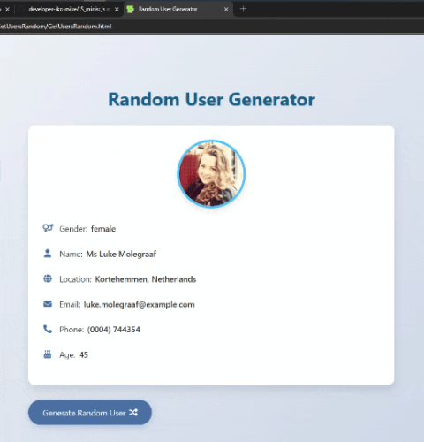

# پروژه Get Random Users - دریافت کاربران تصادفی  



## 👥 توضیحات  
یک ابزار جذاب برای دریافت اطلاعات تصادفی کاربران از API رایگان randomuser.me  

## ✨ ویژگی‌های کلیدی  
- دریافت اطلاعات کامل کاربران به صورت تصادفی  
- نمایش اطلاعات شامل: نام، جنسیت، ایمیل، شماره تلفن و موقعیت جغرافیایی  
- طراحی مدرن با افکت‌های تعاملی زیبا  
- استفاده از Fetch API برای دریافت داده‌ها  
- رابط کاربری ساده و کاربرپسند  

## 🛠️ فناوری‌ها  
<div align="center" style="display: flex; gap: 1rem; justify-content: center; margin: 1.5rem 0;">
  
  
  
</div>

## 🚀 راه‌اندازی  
1. کلون کردن ریپازیتوری:  
```bash
git clone https://github.com/developer-iko-mike/JS_minis.git
```
2. رفتن به پوشه پروژه:  
```bash
cd JS_minis/GetUsersRandom
```
3. اجرای پروژه:  
```bash
open GetUsersRandom.html  # در مک‌اواس
start GetUsersRandom.html # در ویندوز
```

## 🎮 نحوه استفاده  
- روی دکمه "Click To Get Randomly User" کلیک کنید  
- اطلاعات یک کاربر تصادفی نمایش داده می‌شود  
- برای دریافت کاربر جدید مجدداً روی دکمه کلیک کنید  

## 📜 مجوز  
این پروژه تحت [مجوز MIT](https://opensource.org/licenses/MIT) منتشر شده است.  

<div style="margin-top: 2rem; text-align: center; font-size: 0.9rem; color: #666;">
  توسعه داده شده با ❤️ توسط developer-iko-mike
</div>