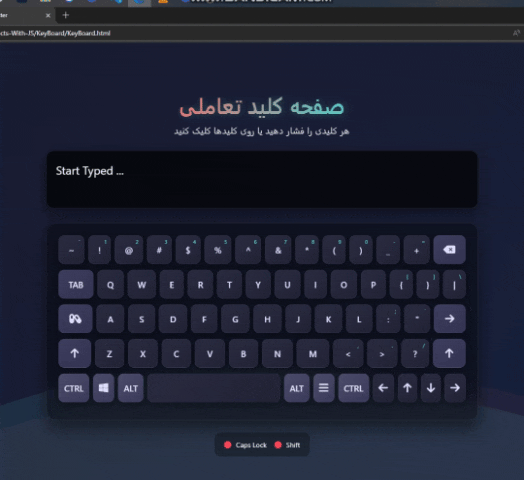

# پروژه Login With Max Length - فرم ورود با محدودیت کاراکتر  



## 🔐 توضیحات  
یک فرم ورود هوشمند با قابلیت نمایش تعداد کاراکترهای باقیمانده و افکت‌های بصری جذاب  

## ✨ ویژگی‌های کلیدی  
- نمایش تعداد کاراکترهای باقیمانده به صورت لحظه‌ای  
- محدودیت 19 کاراکتری برای نام کاربری  
- تغییر گرادیان پس‌زمینه به صورت متحرک  
- افکت‌های تعاملی هنگام فوکوس و تایپ کردن  
- طراحی کاملاً ریسپانسیو برای دستگاه‌های مختلف  

## 🛠️ فناوری‌ها  
<div align="center" style="display: flex; gap: 1rem; justify-content: center; margin: 1.5rem 0;">
  
  
  
</div>

## 🎮 نحوه استفاده  
1. در فیلد ورودی شروع به تایپ کنید  
2. تعداد کاراکترهای باقیمانده به صورت لحظه‌ای محاسبه و نمایش داده می‌شود  
3. پس از رسیدن به حداکثر تعداد کاراکتر مجاز (19 کاراکتر)، امکان تایپ بیشتر وجود ندارد  

## 🚀 راه‌اندازی  
1. کلون کردن ریپازیتوری:  
```bash
git clone https://github.com/developer-iko-mike/JS_minis.git
```
2. رفتن به پوشه پروژه:  
```bash
cd JS_minis/KeyBoard
```
3. اجرای پروژه:  
```bash
open KeyBoard.html  # در مک‌اواس
start KeyBoard.html # در ویندوز
```

## 🎨 ویژگی‌های طراحی  
- تغییر آیکون @ هنگام فوکوس  
- تغییر رنگ حاشیه‌ها هنگام تعامل  
- گرادیان متحرک در پس‌زمینه  
- نمایش زیبای تعداد کاراکترهای باقیمانده  

## 📜 مجوز  
این پروژه تحت [مجوز MIT](https://opensource.org/licenses/MIT) منتشر شده است.  

<div style="margin-top: 2rem; text-align: center; font-size: 0.9rem; color: #666;">
  توسعه داده شده با ❤️ توسط developer-iko-mike
</div>

> نکته: این کامپوننت می‌تواند به راحتی در پروژه‌های بزرگتر ادغام شود و برای فیلدهای مختلفی مانند نام کاربری، توئیت‌ها و نظرات قابل استفاده است.