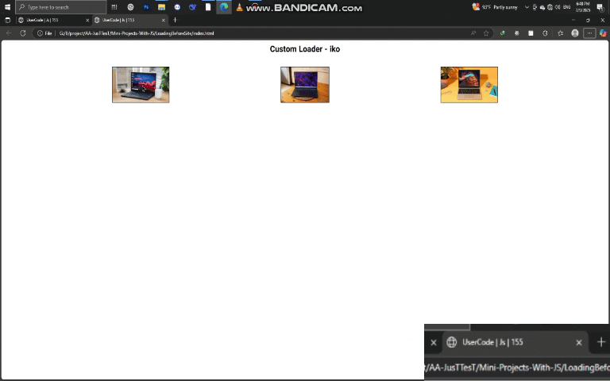

# پروژه Custom Loader - لودر سفارشی  



## 🔄 توضیحات  
یک لودر صفحه سفارشی با افکت fade-out که پس از بارگذاری کامل صفحه محو می‌شود  

## ✨ ویژگی‌های کلیدی  
- نمایش انیمیشن لودینگ جذاب  
- محو شدن نرم پس از بارگذاری صفحه  
- طراحی ساده و سبک  
- سازگار با تمام دستگاه‌ها  
- اجرای خودکار بدون نیاز به تنظیمات  

## 🛠️ فناوری‌ها  
<div align="center" style="display: flex; gap: 1rem; justify-content: center; margin: 1.5rem 0;">
  
  
  
</div>

## 🚀 راه‌اندازی  
1. کلون کردن ریپازیتوری:  
```bash
git clone https://github.com/developer-iko-mike/JS_minis.git
```
2. رفتن به پوشه پروژه:  
```bash
cd JS_minis/LoadingBeforeSite
```
3. اجرای پروژه:  
```bash
open index.html  # در مک‌اواس
start index.html # در ویندوز
```

## 🎨 شخصی‌سازی  
- برای تغییر انیمیشن لودینگ، فایل `loading.gif` را در پوشه images جایگزین کنید  
- برای تنظیم مدت زمان fade-out، مقدار `1s` در فایل CSS را تغییر دهید  
- برای تغییر رنگ پس‌زمینه لودر، مقدار `lightgray` در فایل CSS را ویرایش کنید  

## 📜 مجوز  
این پروژه تحت [مجوز MIT](https://opensource.org/licenses/MIT) منتشر شده است.  

<div style="margin-top: 2rem; text-align: center; font-size: 0.9rem; color: #666;">
  توسعه داده شده با ❤️ توسط developer-iko-mike
</div>

> نکته: این لودر می‌تواند به راحتی در هر پروژه وب ادغام شود و تجربه کاربری بهتری هنگام بارگذاری صفحه ارائه دهد.