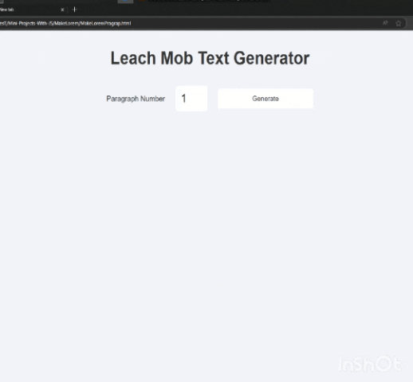

# پروژه Lorem Text Generator - تولیدکننده متن لورم ایپسوم  



## 📝 توضیحات  
یک ابزار تولید متن لورم ایپسوم با قابلیت انتخاب تعداد پاراگراف‌ها و امکان کپی متن  

## ✨ ویژگی‌های کلیدی  
- تولید متن‌های زیبا و متنوع (هم لورم ایپسوم و هم متن‌های ادبی)  
- امکان انتخاب تعداد پاراگراف‌های مورد نیاز (از 1 تا 99)  
- قابلیت کپی متن با یک کلیک ساده  
- طراحی ساده و کاربرپسند  
- واکنش‌گرا و سازگار با تمام دستگاه‌ها  
- پشتیبانی از کلیدهای میانبر (Enter برای تولید و Esc برای پاک کردن)  

## 🛠️ فناوری‌ها  
<div align="center" style="display: flex; gap: 1rem; justify-content: center; margin: 1.5rem 0;">
  
  
  
</div>

## 🚀 راه‌اندازی  
1. کلون کردن ریپازیتوری:  
```bash
git clone https://github.com/developer-iko-mike/JS_minis.git
```
2. رفتن به پوشه پروژه:  
```bash
cd JS_minis/MakeLorem
```
3. اجرای پروژه:  
```bash
open MakeLoremPragrap.html  # در مک‌اواس
start MakeLoremPragrap.html # در ویندوز
```

## 🎮 نحوه استفاده  
1. تعداد پاراگراف‌های مورد نیاز را وارد کنید  
2. روی دکمه Generate کلیک کنید یا کلید Enter را فشار دهید  
3. برای کپی هر پاراگراف، روی آن کلیک کنید  
4. برای پاک کردن متن‌ها، کلید Esc را فشار دهید  

## 📜 مجوز  
این پروژه تحت [مجوز MIT](https://opensource.org/licenses/MIT) منتشر شده است.  

<div style="margin-top: 2rem; text-align: center; font-size: 0.9rem; color: #666;">
  توسعه داده شده با ❤️ توسط developer-iko-mike
</div>

> نکته: این ابزار برای طراحان، توسعه‌دهندگان و نویسندگان بسیار کاربردی است و می‌تواند به راحتی در پروژه‌های مختلف ادغام شود. متن‌های تولیدی ترکیبی از لورم ایپسوم استاندارد و متن‌های ادبی زیبا هستند.