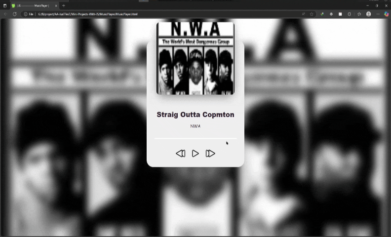

# پروژه Music Player - پخش کننده موسیقی  



## 🎵 توضیحات  
یک پخش کننده موسیقی زیبا و تعاملی با قابلیت نمایش کاور آهنگ و کنترل پخش  

## ✨ ویژگی‌های کلیدی  
- نمایش کاور آلبوم و اطلاعات آهنگ  
- کنترل‌های پخش/توقف، قبلی و بعدی  
- نوار پیشرفت آهنگ با قابلیت کلیک برای جابجایی  
- نمایش زمان گذشته و باقیمانده از آهنگ  
- تغییر خودکار پس‌زمینه متناسب با کاور آهنگ  
- پشتیبانی از کلیدهای میانبر (Space برای پخش/توقف)  
- طراحی ریسپانسیو و سازگار با موبایل  

## 🛠️ فناوری‌ها  
<div align="center" style="display: flex; gap: 1rem; justify-content: center; margin: 1.5rem 0;">
  
  
  
</div>

## 🎛️ کنترل‌ها  
- ▶️ دکمه Play: شروع پخش آهنگ  
- ⏸️ دکمه Pause: توقف موقت آهنگ  
- ⏮️ دکمه Previous: پخش آهنگ قبلی  
- ⏭️ دکمه Next: پخش آهنگ بعدی  
- Space: پخش/توقف آهنگ  
- کلیک روی نوار پیشرفت: جابجایی به قسمت مورد نظر از آهنگ  

## 🚀 راه‌اندازی  
1. کلون کردن ریپازیتوری:  
```bash
git clone https://github.com/developer-iko-mike/JS_minis.git
```
2. رفتن به پوشه پروژه:  
```bash
cd JS_minis/MusicPlayer
```
3. اجرای پروژه:  
```bash
open MusicPlayer.html  # در مک‌اواس
start MusicPlayer.html # در ویندوز
```

## 📜 مجوز  
این پروژه تحت [مجوز MIT](https://opensource.org/licenses/MIT) منتشر شده است.  

<div style="margin-top: 2rem; text-align: center; font-size: 0.9rem; color: #666;">
  توسعه داده شده با ❤️ توسط developer-iko-mike
</div>

> نکته: برای اضافه کردن آهنگ‌های جدید، کافیست اطلاعات آهنگ را به آرایه musicPacks در فایل JS اضافه کنید. این پخش کننده از فرمت MP3 پشتیبانی می‌کند.