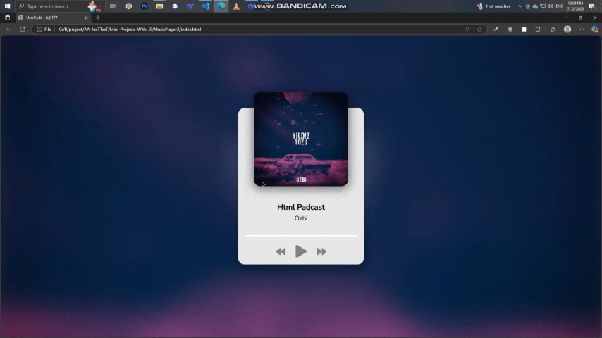

# پروژه Music Player - پخش کننده موسیقی حرفه‌ای



## 🎵 توضیحات
یک پخش کننده موسیقی زیبا و حرفه‌ای با افکت‌های بصری جذاب و قابلیت‌های پیشرفته

## ✨ ویژگی‌های کلیدی
- طراحی مدرن با افکت بلور روی پس‌زمینه
- نمایش کاور آلبوم با انیمیشن زیبا
- نوار پیشرفت هوشمند با قابلیت جابجایی
- نمایش زمان دقیق آهنگ (جاری و کل)
- کنترل‌های پخش/توقف، قبلی و بعدی
- پشتیبانی از کلیدهای میانبر
- طراحی کاملاً ریسپانسیو برای موبایل

## 🛠️ فناوری‌ها
<div align="center" style="display: flex; gap: 1rem; justify-content: center; margin: 1.5rem 0;">
  
  
  
</div>

## 🎛️ راهنمای استفاده
1. **پخش/توقف**: کلیک روی دکمه Play/Pause یا کلید Space
2. **آهنگ بعدی**: کلیک روی دکمه Next یا کلید Arrow Right
3. **آهنگ قبلی**: کلیک روی دکمه Previous یا کلید Arrow Left
4. **جابجایی در آهنگ**: کلیک روی نوار پیشرفت

## 🚀 راه‌اندازی
1. کلون کردن ریپازیتوری:
```bash
git clone https://github.com/developer-iko-mike/JS_minis.git
```
2. رفتن به پوشه پروژه:
```bash
cd JS_minis/MusicPlayer2
```
3. اجرای پروژه:
```bash
open index.html  # در مک‌اواس
start index.html # در ویندوز
```

## 📜 مجوز
این پروژه تحت [مجوز MIT](https://opensource.org/licenses/MIT) منتشر شده است.

<div style="margin-top: 2rem; text-align: center; font-size: 0.9rem; color: #666;">
  توسعه داده شده با ❤️ توسط developer-iko-mike
</div>

> نکته: برای اضافه کردن آهنگ‌های جدید، کافیست اطلاعات آهنگ را به آرایه `songs` در فایل JS اضافه کنید. این پخش‌کننده از فرمت‌های مختلف صوتی پشتیبانی می‌کند.