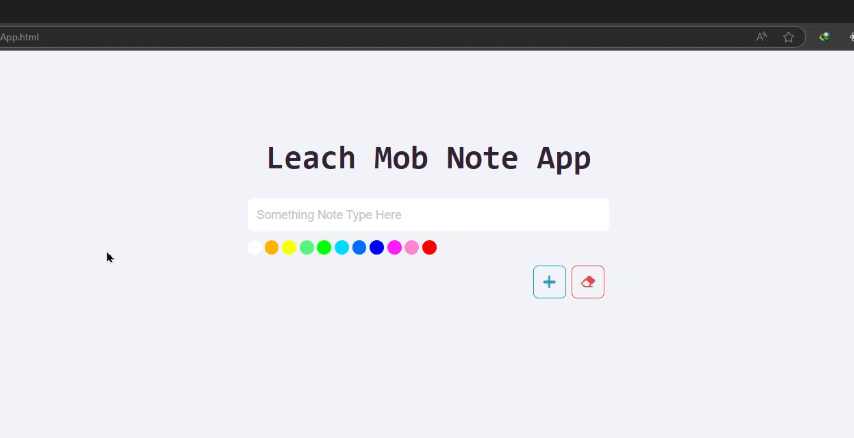

# پروژه NoteApp - برنامه یادداشت‌نویسی



## 📝 توضیحات  
یک برنامه یادداشت‌نویسی ساده و کاربردی با قابلیت تغییر رنگ یادداشت‌ها  

## ✨ ویژگی‌های کلیدی  
- ایجاد یادداشت‌های رنگی  
- پالت رنگ متنوع برای انتخاب رنگ یادداشت  
- امکان حذف یادداشت‌ها با کلیک  
- طراحی ریسپانسیو و سازگار با تمام دستگاه‌ها  
- امکان اضافه کردن یادداشت با دکمه Enter  
- رابط کاربری ساده و intuitive  
- محدودیت تعداد کاراکتر برای هر یادداشت (30 کاراکتر)  

## 🛠️ فناوری‌ها  
<div align="center" style="display: flex; gap: 1rem; justify-content: center; margin: 1.5rem 0;">
  
  
  
</div>

## 🎛️ کنترل‌ها  
- کلید Enter: اضافه کردن یادداشت  
- کلیدهای 0-9: تغییر رنگ یادداشت (مطابق با ترتیب رنگ‌ها)  
- کلیک روی یادداشت: حذف یادداشت  
- دکمه +: اضافه کردن یادداشت  
- دکمه ×: پاک کردن متن نوشته شده  

## 🎨 پالت رنگ  
- 11 رنگ مختلف برای شخصی‌سازی یادداشت‌ها  
- امکان انتخاب رنگ با کلیک روی دایره‌های رنگی  

## 🚀 راه‌اندازی  
1. کلون کردن ریپازیتوری:  
```bash
git clone https://github.com/developer-iko-mike/JS_minis.git
```
2. رفتن به پوشه پروژه:  
```bash
cd JS_minis/NoteApp
```
3. اجرای پروژه:  
```bash
open NoteApp.html  # در مک‌اواس
start NoteApp.html # در ویندوز
```

## 📜 مجوز  
این پروژه تحت [مجوز MIT](https://opensource.org/licenses/MIT) منتشر شده است.  

<div style="margin-top: 2rem; text-align: center; font-size: 0.9rem; color: #666;">
  توسعه داده شده با ❤️ توسط developer-iko-mike
</div>

> نکته: برای تغییر رنگ یادداشت می‌توانید هم از کلیدهای عددی 0-9 استفاده کنید و هم با کلیک روی دایره‌های رنگی رنگ مورد نظر را انتخاب نمایید.