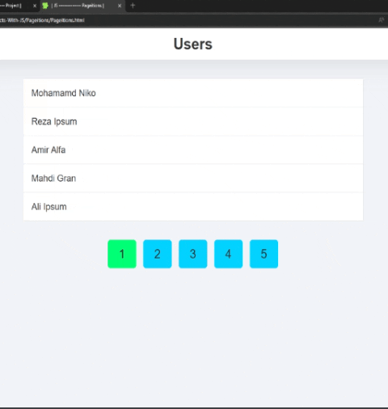

# پروژه Pageitions - سیستم صفحه‌بندی (Pagination)



## 📄 توضیحات  
یک سیستم صفحه‌بندی کاربردی و تعاملی برای نمایش لیست کاربران با قابلیت پیمایش بین صفحات مختلف  

## ✨ ویژگی‌های کلیدی  
- نمایش 5 آیتم در هر صفحه  
- پیمایش آسان بین صفحات با دکمه‌های شماره صفحه  
- هایلایت صفحه فعال برای شناسایی آسان  
- انیمیشن‌های زیبا هنگام هاور روی دکمه‌ها و آیتم‌ها  
- طراحی ریسپانسیو و سازگار با موبایل  
- ساختار کد تمیز و ماژولار  

## 🛠️ فناوری‌ها  
<div align="center" style="display: flex; gap: 1rem; justify-content: center; margin: 1.5rem 0;">
  
  
  
</div>

## 🎛️ عملکرد  
- هر صفحه حداکثر 5 کاربر نمایش داده می‌شود  
- دکمه‌های شماره صفحه در پایین لیست قرار دارند  
- صفحه فعال با رنگ سبز مشخص شده است  
- هاور روی دکمه‌ها باعث ایجاد انیمیشن می‌شود  
- هاور روی آیتم‌های لیست باعث تغییر رنگ زمینه می‌شود  

## 📊 ساختار داده  
- لیست کاربران شامل 24 آیتم با ساختار زیر:  
```javascript
{
  id: number,
  name: string,
  family: string
}
```

## 🚀 راه‌اندازی  
1. کلون کردن ریپازیتوری:  
```bash
git clone https://github.com/developer-iko-mike/JS_minis.git
```
2. رفتن به پوشه پروژه:  
```bash
cd JS_minis/Pageitions
```
3. اجرای پروژه:  
```bash
open Pageitions.html  # در مک‌اواس
start Pageitions.html # در ویندوز
```

## 📜 مجوز  
این پروژه تحت [مجوز MIT](https://opensource.org/licenses/MIT) منتشر شده است.  

<div style="margin-top: 2rem; text-align: center; font-size: 0.9rem; color: #666;">
  توسعه داده شده با ❤️ توسط developer-iko-mike
</div>

> نکته: برای تغییر تعداد آیتم‌های نمایش داده شده در هر صفحه، می‌توانید متغیر `rows` در فایل JavaScript را ویرایش کنید.