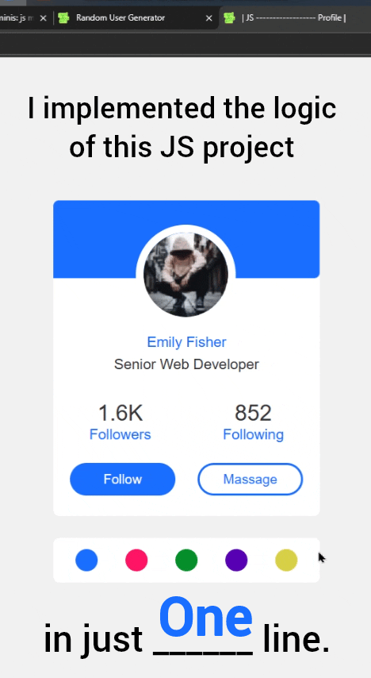

# پروژه Profile - پروفایل کاربری تعاملی

<!--  -->

## 👤 توضیحات  
یک پروفایل کاربری زیبا و تعاملی با قابلیت تغییر تم رنگی به صورت دینامیک

## ✨ ویژگی‌های کلیدی  
- تغییر رنگ تم اصلی با انتخاب از پالت رنگی  
- طراحی مدرن و ریسپانسیو  
- انیمیشن‌های ظریف هنگام تعامل  
- پروفایل دایره‌ای با حاشیه سفید  
- نمایش آمار فالوورها و فالووینگ‌ها  
- دکمه‌های عملگرای Follow و Message  

## 🎨 پالت رنگی  
<div style="display: flex; justify-content: center; gap: 1rem; margin: 1rem 0;">
  <div style="width: 30px; height: 30px; border-radius: 50%; background: #1a6eff;"></div>
  <div style="width: 30px; height: 30px; border-radius: 50%; background: #ff1466;"></div>
  <div style="width: 30px; height: 30px; border-radius: 50%; background: #038f2b;"></div>
  <div style="width: 30px; height: 30px; border-radius: 50%; background: #5700b3;"></div>
  <div style="width: 30px; height: 30px; border-radius: 50%; background: #d8d044;"></div>
</div>

## 🛠️ فناوری‌ها  
<div align="center" style="display: flex; gap: 1rem; justify-content: center; margin: 1.5rem 0;">
  
  
  
</div>

## 🎛️ اجزای پروفایل  
- هدر رنگی با قابلیت تغییر رنگ  
- عکس پروفایل دایره‌ای  
- نام و شغل کاربر  
- بخش آمار (Followers/Following)  
- دکمه‌های Follow و Message  
- پالت انتخاب رنگ  

## 🚀 راه‌اندازی  
1. کلون کردن ریپازیتوری:  
```bash
git clone https://github.com/developer-iko-mike/JS_minis.git
```
2. رفتن به پوشه پروژه:  
```bash
cd JS_minis/Profile
```
3. اجرای پروژه:  
```bash
open Profile.html  # در مک‌اواس
start Profile.html # در ویندوز
```

## 📜 مجوز  
این پروژه تحت [مجوز MIT](https://opensource.org/licenses/MIT) منتشر شده است.  

<div style="margin-top: 2rem; text-align: center; font-size: 0.9rem; color: #666;">
  توسعه داده شده با ❤️ توسط developer-iko-mike
</div>

> نکته: برای اضافه کردن رنگ‌های جدید به پالت، کافیست در فایل HTML یک المان div جدید با کلاس color و data-color با مقدار HEX رنگ مورد نظر اضافه کنید.