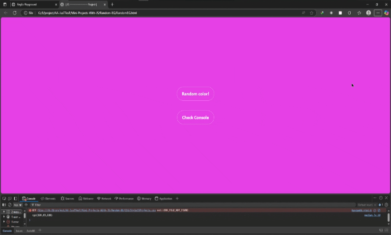

# پروژه Random Background - تغییر رنگ تصادفی پس‌زمینه



## 🎨 توضیحات  
یک پروژه ساده و جذاب که هر 500 میلی‌ثانیه رنگ پس‌زمینه صفحه را به صورت تصادفی تغییر می‌دهد

## ✨ ویژگی‌های کلیدی  
- تولید رنگ‌های RGB کاملاً تصادفی  
- تغییر خودکار هر نیم ثانیه  
- نمایش کد رنگ در کنسول مرورگر  
- دکمه‌های زیبا با افکت hover  
- طراحی مینیمال و تمیز  

## 🛠️ فناوری‌ها  
<div align="center" style="display: flex; gap: 1rem; justify-content: center; margin: 1.5rem 0;">
  
  
  
</div>

## 🎛️ عملکرد پروژه  
- تولید اعداد تصادفی بین 0 تا 255 برای مقادیر Red, Green, Blue  
- ساخت رشته RGB با مقادیر تولید شده  
- اعمال رنگ به پس‌زمینه صفحه  
- نمایش کد رنگ در کنسول برای بررسی  
- تکرار فرآیند هر 500 میلی‌ثانیه  

## 💻 نمونه خروجی کنسول  
```
rgb(123,45,67)
rgb(234,56,78)
rgb(45,167,89)
```

## 🚀 راه‌اندازی  
1. کلون کردن ریپازیتوری:  
```bash
git clone https://github.com/developer-iko-mike/JS_minis.git
```
2. رفتن به پوشه پروژه:  
```bash
cd JS_minis/Random-BG
```
3. اجرای پروژه:  
```bash
open RandomBG.html  # در مک‌اواس
start RandomBG.html # در ویندوز
```

## 📜 مجوز  
این پروژه تحت [مجوز MIT](https://opensource.org/licenses/MIT) منتشر شده است.  

<div style="margin-top: 2rem; text-align: center; font-size: 0.9rem; color: #666;">
  توسعه داده شده با ❤️ توسط developer-iko-mike
</div>

> نکته: برای تغییر سرعت تغییر رنگ‌ها، می‌توانید عدد 500 در تابع setInterval را در فایل JavaScript ویرایش کنید (عدد بر حسب میلی‌ثانیه است).