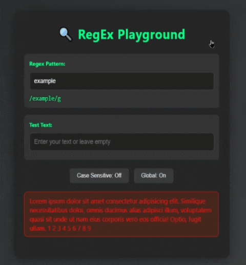

# پروژه Regex Playground - محیط تمرین عبارات منظم



## 🔍 Regex Playground - محیط تعاملی تست عبارات منظم

### ✨ ویژگی‌های کلیدی
- محیطی تعاملی برای تست و یادگیری Regular Expressions
- امکان تغییر الگوها به صورت بلادرنگ
- نمایش نتایج با رنگ‌بندی مشخص (موفق/ناموفق)
- قابلیت تنظیم حساسیت به حروف (Case Sensitive)
- حالت جستجوی سراسری (Global Search)
- طراحی مدرن و کاربرپسند با تم تاریک
- واکنش‌گرا و سازگار با دستگاه‌های مختلف

### 🛠️ فناوری‌های استفاده شده
<div align="center" style="display: flex; gap: 1rem; justify-content: center; margin: 1.5rem 0;">
  
  
  
</div>

### 🎯 کاربردهای پروژه
- یادگیری و تمرین Regular Expressions
- تست الگوهای Regex قبل از استفاده در کد
- اشکال‌زدایی عبارات منظم
- درک بهتر عملکرد Flags مختلف در Regex

### 🧩 اجزای اصلی پروژه
1. **ورودی الگو**: بخشی برای وارد کردن الگوی Regex
2. **ورودی متن**: بخشی برای وارد کردن متن تست
3. **کنترل‌ها**: 
   - دکمه تنظیم حساسیت به حروف (Case Sensitive)
   - دکمه حالت جستجوی سراسری (Global)
4. **نمایشگر الگو**: نمایش الگوی جاری به همراه flags
5. **نتایج**: نمایش نتیجه تست با رنگ‌بندی مناسب

### 🎨 طراحی و رابط کاربری
- تم رنگی تاریک با هایلایت سبز
- گرادینت زیبا برای پس‌زمینه
- کارت‌های شیشه‌ای با سایه‌های نرم
- انیمیشن‌های ظریف برای تعاملات کاربر
- فونت‌های خوانا و چیدمان منطقی

### 🚀 نحوه استفاده
1. الگوی Regex خود را در فیلد مربوطه وارد کنید
2. متن مورد نظر برای تست را وارد نمایید (یا از متن پیش‌فرض استفاده کنید)
3. تنظیمات مورد نیاز (حساسیت به حروف، حالت سراسری) را اعمال کنید
4. نتیجه را به صورت بلادرنگ مشاهده نمایید

### 📦 نصب و اجرا
```bash
git clone https://github.com/developer-iko-mike/JS_minis.git
cd JS_minis/RegexPlayground
open index.html
```

### 📝 مثال‌های کاربردی
```regex
/\w{5,}@gmail\.com/g       # بررسی ایمیل‌های Gmail
/^09\d{9}$/                # شماره موبایل ایرانی
/^([12]\d{3})-(0[1-9]|1[0-2])-(0[1-9]|[12][0-9]|3[01])$/ # تاریخ
```

### 📚 منابع یادگیری
- [RegexLearn](https://regexlearn.com)
- [MDN Regular Expressions](https://developer.mozilla.org/en-US/docs/Web/JavaScript/Guide/Regular_Expressions)
- [Regex101](https://regex101.com)

### 📜 مجوز
این پروژه تحت [مجوز MIT](https://opensource.org/licenses/MIT) منتشر شده است.

<div style="margin-top: 2rem; text-align: center; font-size: 0.9rem; color: #666;">
  توسعه داده شده با ❤️ توسط developer-iko-mike
</div>

> نکته: این پروژه به صورت مداوم در حال توسعه است و ویژگی‌های جدیدی به آن اضافه خواهد شد. برای پیشنهادات و مشارکت می‌توانید به ریپازیتوری پروژه مراجعه کنید.