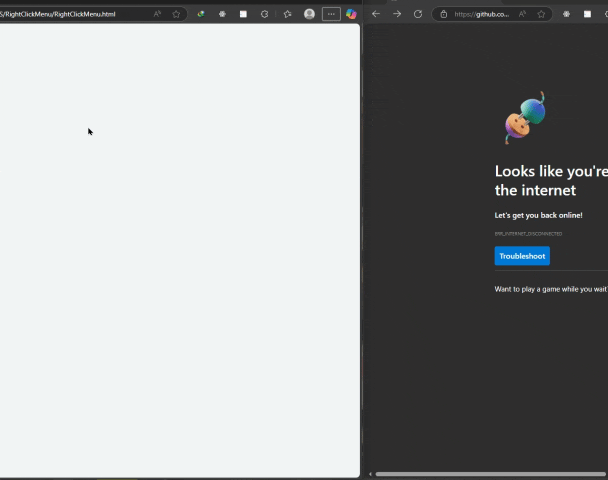

# پروژه Right Click Menu - منوی کلیک راست سفارشی



## 🖱️ توضیحات  
یک منوی کلیک راست سفارشی و زیبا با افکت‌های تعاملی و گزینه‌های کاربردی

## ✨ ویژگی‌های کلیدی  
- نمایش منو در موقعیت دقیق کلیک راست  
- افکت‌های hover تعاملی روی آیتم‌ها  
- تغییر آیکون‌ها هنگام هاور  
- بسته شدن منو با کلیک چپ یا کلید Escape  
- طراحی مدرن و ریسپانسیو  
- 7 گزینه کاربردی با آیکون‌های اختصاصی  

## 🛠️ فناوری‌ها  
<div align="center" style="display: flex; gap: 1rem; justify-content: center; margin: 1.5rem 0;">
  
  
  
</div>

## 📋 گزینه‌های منو  
- Share (اشتراک‌گذاری)  
- Rename (تغییر نام)  
- Copy Link Address (کپی آدرس لینک)  
- Copy To (کپی به)  
- Move To (انتقال به)  
- Download (دانلود)  
- Delete (حذف)  

## 🎨 طراحی ویژه  
- تغییر رنگ متن هنگام هاور  
- نمایش آیکون‌های رنگی هنگام هاور  
- افکت پس‌زمینه هنگام هاور  
- انیمیشن‌های نرم برای تغییر حالت‌ها  
- رنگ متفاوت برای گزینه حذف  

## 🚀 راه‌اندازی  
1. کلون کردن ریپازیتوری:  
```bash
git clone https://github.com/developer-iko-mike/JS_minis.git
```
2. رفتن به پوشه پروژه:  
```bash
cd JS_minis/RightClickMenu
```
3. اجرای پروژه:  
```bash
open RightClickMenu.html  # در مک‌اواس
start RightClickMenu.html # در ویندوز
```

## 📜 مجوز  
این پروژه تحت [مجوز MIT](https://opensource.org/licenses/MIT) منتشر شده است.  

<div style="margin-top: 2rem; text-align: center; font-size: 0.9rem; color: #666;">
  توسعه داده شده با ❤️ توسط developer-iko-mike
</div>

> نکته: برای اضافه کردن گزینه‌های جدید به منو، کافیست المان li جدید با ساختار مشابه به فایل HTML اضافه کنید و استایل‌های مربوطه را در CSS تعریف نمایید.