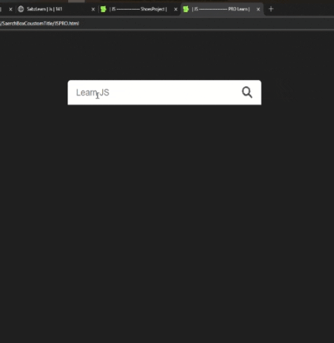

# پروژه AutoComplete Search - جستجوی خودکار



## 🔍 توضیحات  
یک سیستم جستجوی خودکار با قابلیت پیشنهاد کلمات بر اساس ورودی کاربر

## ✨ ویژگی‌های کلیدی  
- لیست پیشنهادات هوشمند بر اساس حروف وارد شده  
- بیش از 70 پیشنهاد از پیش تعریف شده  
- طراحی مدرن و ریسپانسیو  
- امکان انتخاب پیشنهادات با کلیک  
- پاک کردن سریع جستجو با آیکون یا کلیدهای Esc/Del/Enter  
- افکت‌های تعاملی زیبا هنگام هاور  

## 🛠️ فناوری‌ها  
<div align="center" style="display: flex; gap: 1rem; justify-content: center; margin: 1.5rem 0;">
  
  
  
</div>

## 🎛️ عملکرد سیستم  
- فیلتر کردن پیشنهادات بر اساس حروف اول کلمه وارد شده  
- نمایش لیست پیشنهادات در زیر فیلد جستجو  
- تغییر رنگ و اندازه آیتم‌ها هنگام هاور  
- پاک کردن محتوای جستجو با:  
  - کلیک روی آیکون  
  - کلیدهای Esc, Delete یا Enter  
- محدودیت 35 کاراکتری برای فیلد جستجو  

## 📋 دسته‌بندی پیشنهادات  
- موضوعات برنامه‌نویسی  
- سایت‌های معروف  
- بازی‌های کامپیوتری  
- موضوعات عمومی و متنوع  

## 🚀 راه‌اندازی  
1. کلون کردن ریپازیتوری:  
```bash
git clone https://github.com/developer-iko-mike/JS_minis.git
```
2. رفتن به پوشه پروژه:  
```bash
cd JS_minis/SaerchBoxCoustomTitle
```
3. اجرای پروژه:  
```bash
open JSPRO.html  # در مک‌اواس
start JSPRO.html # در ویندوز
```

## 📜 مجوز  
این پروژه تحت [مجوز MIT](https://opensource.org/licenses/MIT) منتشر شده است.  

<div style="margin-top: 2rem; text-align: center; font-size: 0.9rem; color: #666;">
  توسعه داده شده با ❤️ توسط developer-iko-mike
</div>

> نکته: برای اضافه کردن پیشنهادات جدید، می‌توانید آیتم‌های جدید را به آرایه Suggestions در فایل JavaScript اضافه کنید. سیستم به صورت خودکار آنها را در جستجو لحاظ خواهد کرد.