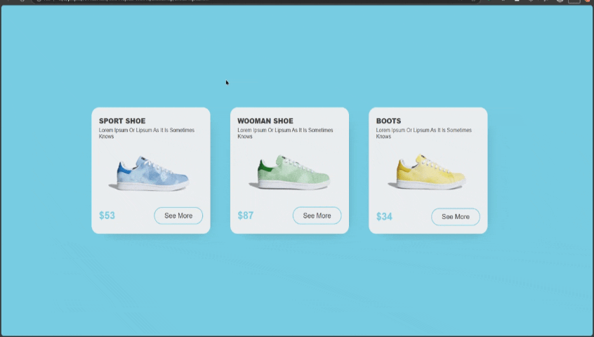

# پروژه Shoes E-Commerce - فروشگاه اینترنتی کفش



## 👟 توضیحات  
یک فروشگاه اینترنتی کفش با صفحه محصولات و جزئیات محصول

## ✨ ویژگی‌های کلیدی  
- نمایش محصولات در کارت‌های زیبا  
- صفحه اختصاصی برای هر محصول با جزئیات کامل  
- طراحی ریسپانسیو و سازگار با موبایل  
- انتقال پارامترهای محصول از طریق URL  
- دکمه بازگشت به صفحه اصلی  
- افکت‌های تعاملی زیبا  

## 🛠️ فناوری‌ها  
<div align="center" style="display: flex; gap: 1rem; justify-content: center; margin: 1.5rem 0;">
  
  
  
</div>

## 🏷️ محصولات موجود  
1. **SPORT SHOE** - $53  
2. **WOOMAN SHOE** - $87  
3. **BOOTS** - $34  

## 🎨 طراحی  
- رنگ آبی فیروزه‌ای به عنوان تم اصلی  
- کارت‌های محصول با سایه‌های زیبا  
- صفحه محصول با چیدمان دو ستونه  
- طراحی مینیمال و کاربرپسند  

## 📱 ریسپانسیو  
- تغییر چیدمان به تک ستونه در دستگاه‌های موبایل  
- تنظیم اندازه‌ها و فاصله‌ها برای نمایش بهتر  
- بهینه‌سازی ناوبری برای صفحه‌نمایش کوچک  

## 🚀 راه‌اندازی  
1. کلون کردن ریپازیتوری:  
```bash
git clone https://github.com/developer-iko-mike/JS_minis.git
```
2. رفتن به پوشه پروژه:  
```bash
cd JS_minis/ShoesShop
```
3. اجرای پروژه:  
```bash
open ShoesProject.html  # در مک‌اواس
start ShoesProject.html # در ویندوز
```

## 📜 مجوز  
این پروژه تحت [مجوز MIT](https://opensource.org/licenses/MIT) منتشر شده است.  

<div style="margin-top: 2rem; text-align: center; font-size: 0.9rem; color: #666;">
  توسعه داده شده با ❤️ توسط developer-iko-mike
</div>

> نکته: برای اضافه کردن محصولات جدید، کافیست آیتم جدید را به آرایه shoes در فایل‌های JavaScript اضافه کنید. سیستم به صورت خودکار آن را در لیست محصولات نمایش خواهد داد.