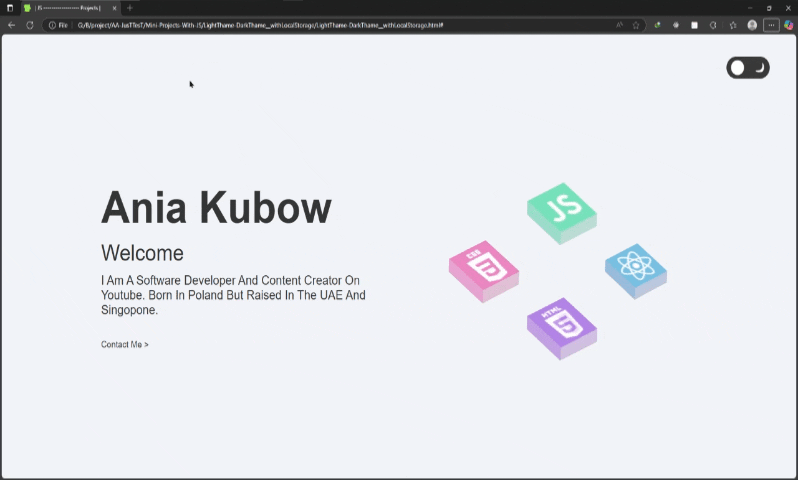

# پروژه Dark/Light Theme Switcher - تغییر تم تاریک/روشن



## 🌓 توضیحات
یک سیستم تغییر تم پیشرفته با قابلیت ذخیره تنظیمات کاربر در localStorage

## ✨ ویژگی‌های کلیدی
- تغییر آسان بین تم تاریک و روشن
- ذخیره‌سازی آخرین انتخاب کاربر در localStorage
- طراحی مدرن و واکنش‌گرا
- افکت‌های انتقال نرم بین تم‌ها
- نمایش آیکون مناسب برای هر حالت

## 🛠️ فناوری‌ها
<div align="center" style="display: flex; gap: 1rem; justify-content: center; margin: 1.5rem 0;">
  
  
  
</div>

## 🚀 راه‌اندازی
1. کلون کردن ریپازیتوری:
```bash
git clone https://github.com/developer-iko-mike/JS_minis.git
```
2. رفتن به پوشه پروژه:
```bash
cd JS_minis/ThemeSwitcher
```
3. اجرای پروژه:
```bash
open LightThame-DarkThame__withLocalStorage.html  # در مک‌اواس
start LightThame-DarkThame__withLocalStorage.html # در ویندوز
```

## 🎮 نحوه استفاده
- روی دکمه تغییر تم کلیک کنید تا بین حالت تاریک و روشن جابجا شوید
- آخرین انتخاب شما به صورت خودکار ذخیره می‌شود
- با بارگذاری مجدد صفحه، تم انتخابی شما حفظ می‌شود

## 📜 مجوز
این پروژه تحت [مجوز MIT](https://opensource.org/licenses/MIT) منتشر شده است.

<div style="margin-top: 2rem; text-align: center; font-size: 0.9rem; color: #666;">
  توسعه داده شده با ❤️ توسط developer-iko-mike
</div>

> نکته: این کامپوننت به راحتی می‌تواند در هر پروژه وب ادغام شود و تجربه کاربری بهتری برای کاربران فراهم کند.