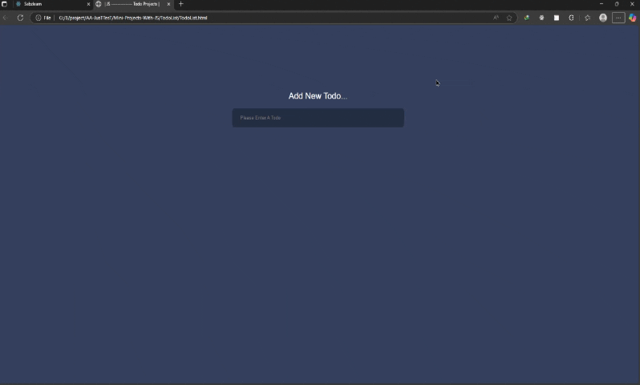

# پروژه Todo List - لیست کارهای روزانه



## 📝 توضیحات  
یک برنامه لیست کارهای روزانه ساده و کاربردی با قابلیت افزودن و حذف آیتم‌ها

## ✨ ویژگی‌های کلیدی  
- افزودن کار جدید با کلید Enter  
- حذف آیتم‌ها با کلیک روی آیکون سطل زباله  
- اعتبارسنجی ورودی‌ها (عدم پذیرش فیلد خالی یا متن‌های طولانی)  
- نمایش پیام‌های اطلاع‌رسانی  
- طراحی ریسپانسیو و سازگار با موبایل  
- پویانمایی‌های زیبا  

## 🛠️ فناوری‌ها  
<div align="center" style="display: flex; gap: 1rem; justify-content: center; margin: 1.5rem 0;">
  
  
  
</div>

## 🎨 طراحی  
- رنگ‌بندی بنفش و آبی تیره  
- کارت‌های آیتم‌ها با افکت‌های زیبا  
- فیلد ورودی با هایلایت آبی  
- آیکون سطل زباله برای حذف آیتم‌ها  
- پیام‌های خطا با رنگ قرمز  
- نوتیفیکیشن سبز رنگ برای تأیید افزودن  

## ⚙️ عملکرد  
- محدودیت 25 کاراکتری برای هر آیتم  
- نمایش پیام خطا برای فیلدهای خالی  
- نمایش پیام خطا برای متن‌های طولانی  
- نمایش پیام موفقیت آمیز هنگام افزودن آیتم  
- حذف آیتم با کلیک روی آیکون  

## 📱 ریسپانسیو  
- تنظیم عرض المان‌ها برای صفحه‌نمایش موبایل  
- حفظ خوانایی و کاربرپسندی در دستگاه‌های مختلف  

## 🚀 راه‌اندازی  
1. کلون کردن ریپازیتوری:  
```bash
git clone https://github.com/developer-iko-mike/JS_minis.git
```
2. رفتن به پوشه پروژه:  
```bash
cd JS_minis/TodoList
```
3. اجرای پروژه:  
```bash
open TodoList.html  # در مک‌اواس
start TodoList.html # در ویندوز
```

## 📜 مجوز  
این پروژه تحت [مجوز MIT](https://opensource.org/licenses/MIT) منتشر شده است.  

<div style="margin-top: 2rem; text-align: center; font-size: 0.9rem; color: #666;">
  توسعه داده شده با ❤️ توسط developer-iko-mike
</div>

> نکته: برای تغییر محدودیت تعداد کاراکترها، می‌توانید عدد 25 در فایل JavaScript را ویرایش کنید. همچنین می‌توانید رنگ‌بندی را از طریق فایل CSS تغییر دهید.