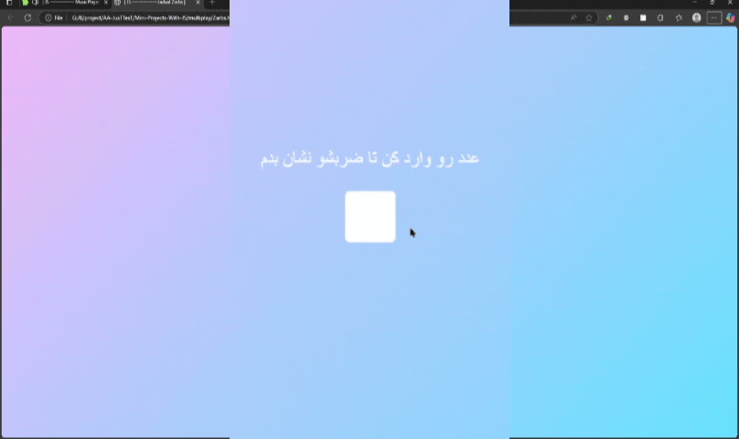

# پروژه جدول ضرب تعاملی - Interactive Multiplication Table



## ✖️ توضیحات
یک ابزار آموزشی جذاب برای نمایش جدول ضرب اعداد به صورت تعاملی

## ✨ ویژگی‌های کلیدی
- نمایش سریع جدول ضرب اعداد از 1 تا 10
- رابط کاربری ساده و کودک‌پسند
- افکت‌های بصری جذاب
- قابلیت پاک کردن نتایج با کلید Backspace
- طراحی ریسپانسیو برای تمام دستگاه‌ها
- راهنمای تعاملی برای کاربران

## 🛠️ فناوری‌ها
<div align="center" style="display: flex; gap: 1rem; justify-content: center; margin: 1.5rem 0;">
  
  
  
</div>

## 🚀 راه‌اندازی
1. کلون کردن ریپازیتوری:
```bash
git clone https://github.com/developer-iko-mike/JS_minis.git
```
2. رفتن به پوشه پروژه:
```bash
cd JS_minis/multiplay
```
3. اجرای پروژه:
```bash
open Zarbs.html  # در مک‌اواس
start Zarbs.html # در ویندوز
```

## 🎮 نحوه استفاده
1. عدد مورد نظر خود را وارد کنید
2. کلید Enter را فشار دهید تا جدول ضرب نمایش داده شود
3. برای پاک کردن نتایج از کلید Backspace استفاده کنید
4. برای شروع مجدد، روی فیلد ورودی کلیک کنید

## 📜 مجوز
این پروژه تحت [مجوز MIT](https://opensource.org/licenses/MIT) منتشر شده است.

<div style="margin-top: 2rem; text-align: center; font-size: 0.9rem; color: #666;">
  توسعه داده شده با ❤️ توسط developer-iko-mike
</div>

> نکته: این ابزار برای آموزش ریاضی به کودکان بسیار مناسب است و می‌تواند به عنوان بخشی از برنامه‌های آموزشی استفاده شود. طراحی رنگارنگ و ساده آن یادگیری را برای کودکان لذت‌بخش می‌کند.